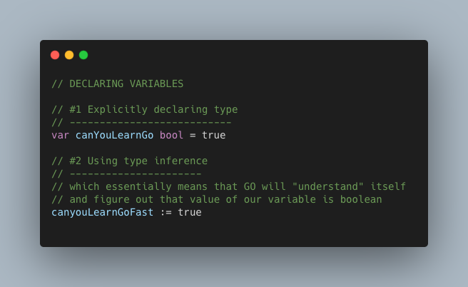
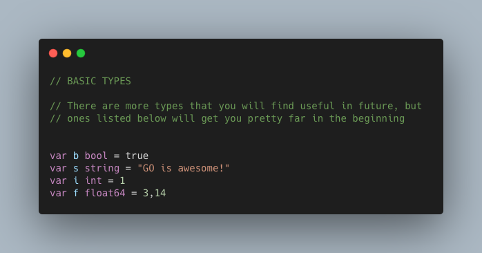
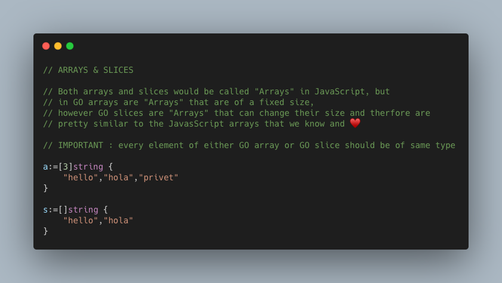
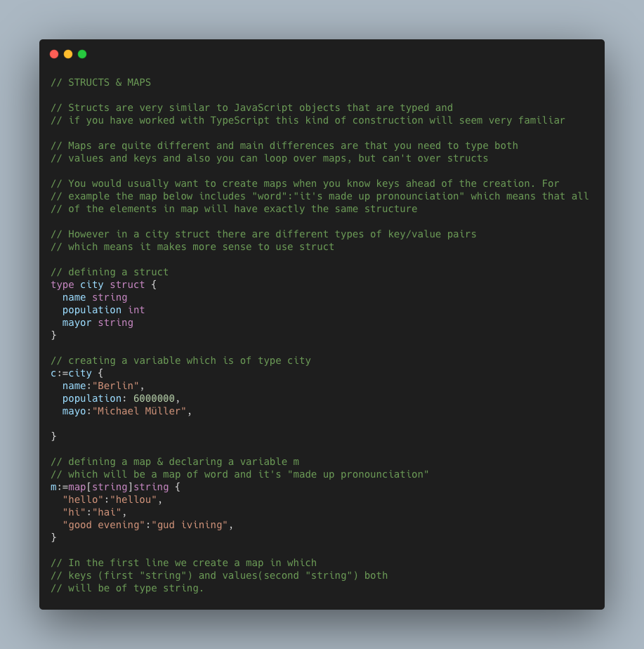

# GO snippets

Doc below is just my attempt to document various learnings
from my journey of exploring GO language.

**_Folder evenOdd includes a program goes over numbers 1-10 and prints out whether number is even or odd_**
To run the program switch to the evenOdd folder and run the command below in your terminal :
`go run main.go`

As GO is strictly typed language before declaring variable
we always have to know the type.

## Variable declaring convetion

Unlinke in JavaScript, in GO quite often you will see variables declared with just a single
letter. In the first example I will use more familiar and explicit camelCase, but
be aware that at some point later on, you will see just single letter variable declarations.

## Declaring variables



```
#1
var canYouLearnGo bool = true

#2
canyouLearnGoFast := true

```

As for redeclaring variables, you just use simply equals sign as can be seen below :

```
#3
canyouLearnGoFast = false
```

## Basic types



```
var b bool = true
var s string = "GO is awesome!"
var i int = 1
var f float64 = 3,14
```

## Arrays & Slices



```
a:=[3]string {
	"hello","hola","privet"
}

s:=[]string {
	"hello","hola"
}
```

## Structs & Maps



```
// defining a struct
type city struct {
  name string
  population int
  mayor string
}

// creating a variable which is of type city
c:=city {
  name:"Berlin",
  population: 6000000,
  mayo:"Michael Müller",

}

// defining a map & declaring a variable m
// which will be a map of word and it's "made up pronounciation"
m:=map[string]string {
  "hello":"hellou",
  "hi":"hai",
  "good evening":"gud ivining",
}
```
